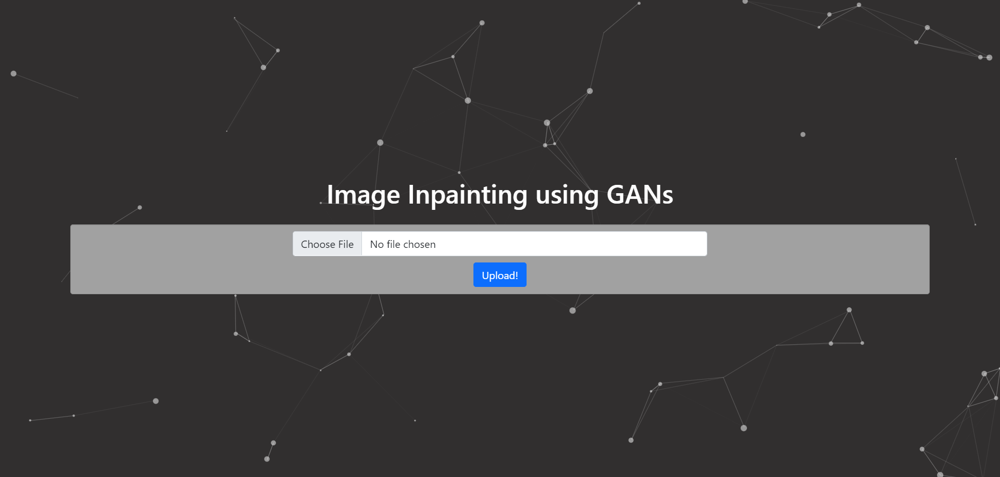
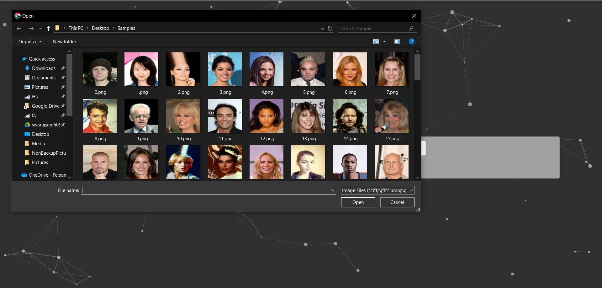
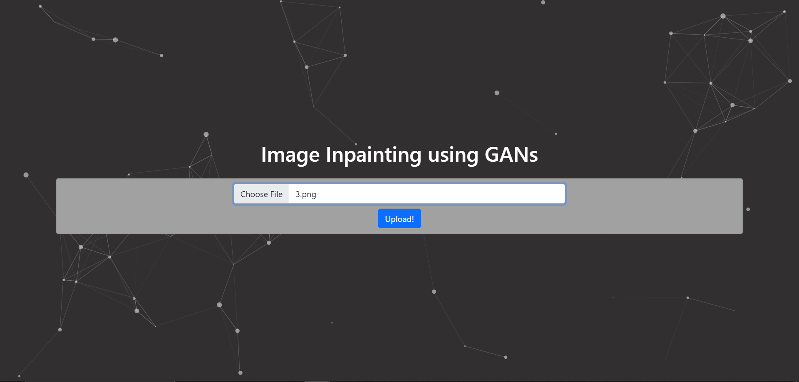
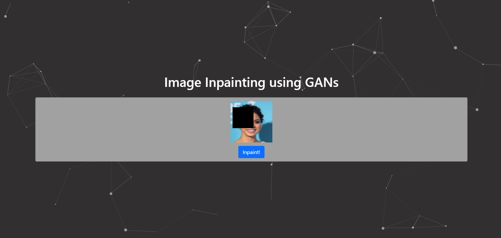
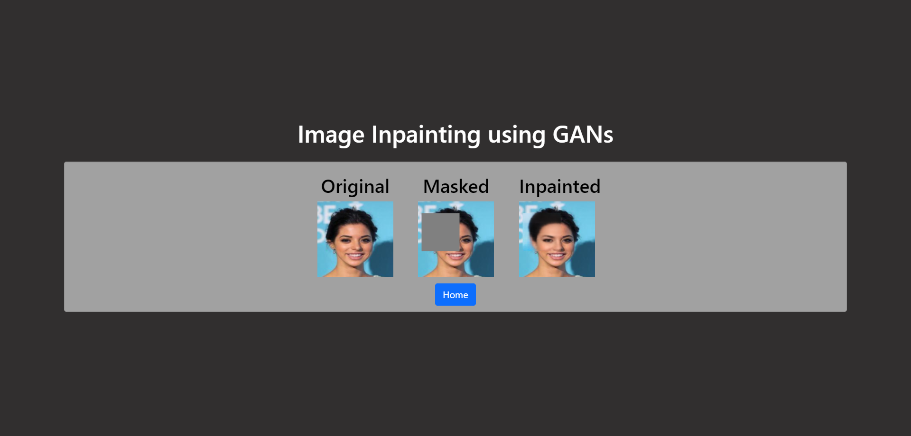

# Image Inpainting using Generative Adverserial Networks

Run the following commands to run the app locally
```
git clone https://github.com/swrjsingh/ImageInpaintingIEEECompsoc.git
cd ImageInpaintingIEEECompsoc
pip install -r requirements.txt
python app.py
```

### Working App 

Click on 'Choose file'

Select any of the images, 

Click on Upload

Place the mask any any desired position, and then click "Inpaint"

The original image, masked image, and inpainted image are displayed
